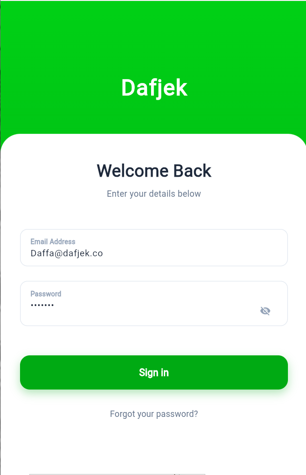
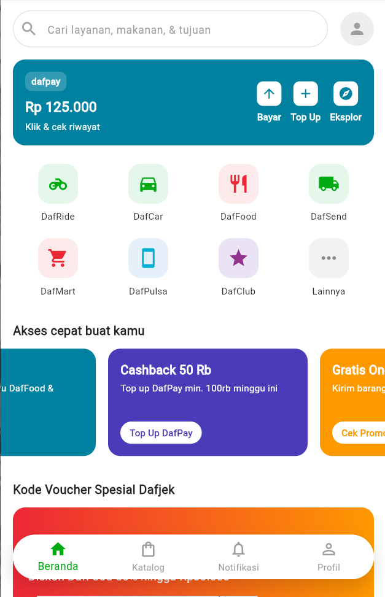
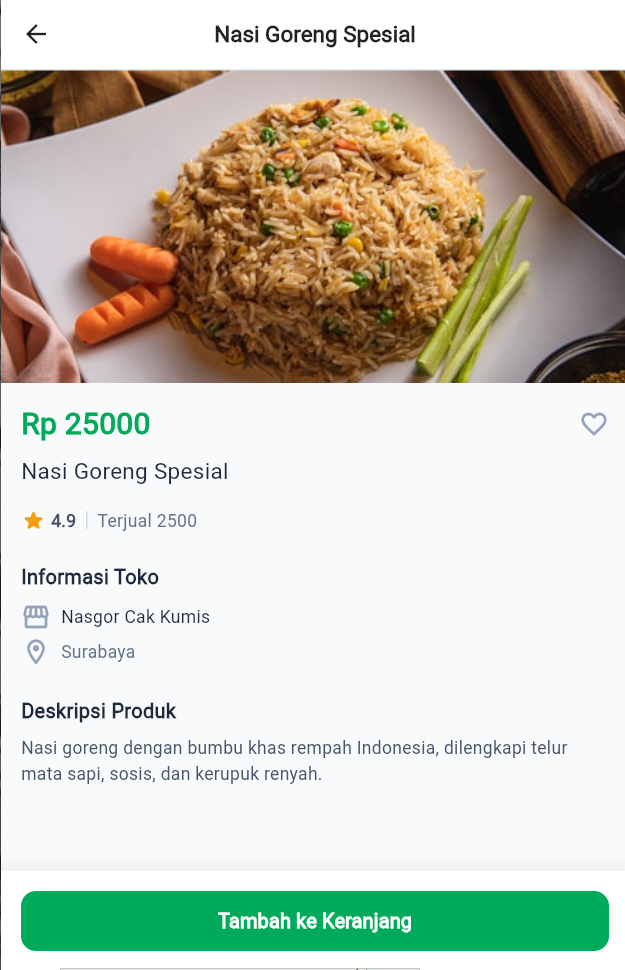
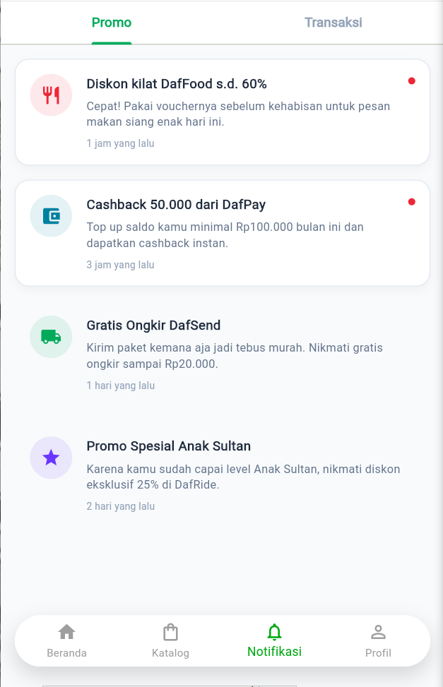
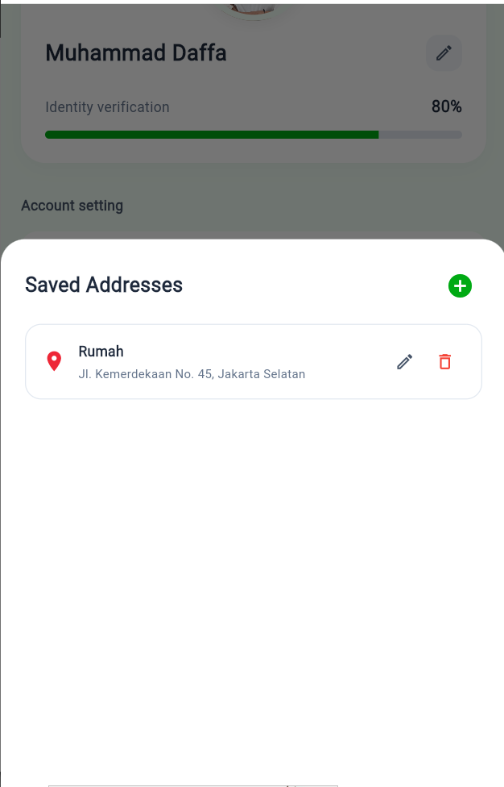
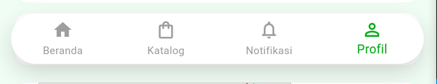

# Dafjek (UTS Pemrograman Mobile)

Proyek ini adalah aplikasi *mobile* berbasis Flutter yang dibangun sebagai pemenuhan tugas Ujian Tengah Semester (UTS) mata kuliah Pemrograman Mobile. Aplikasi ini mensimulasikan antarmuka dan alur pengguna (*User Flow*) layaknya aplikasi *super-app* populer (Gojek) dengan desain yang modern, *clean*, dan dinamis.

**Nama:** Muhammad Daffa Adzdzikra D 
**NIM :** 2306082
**Mata Kuliah:** Pemrograman Mobile  

---

## 📱 Fitur Utama (Pages & Flow)

Aplikasi ini menggunakan sistem *Named Routes* dan kerangka navigasi yang utuh untuk menghubungkan berbagai halaman:

1. **Halaman Login (`/login`)**
   - UI eksklusif dengan background gradasi hijau dan form *overlap* bergaya modern.
   - Validasi input (Email dan Password).
   - Logika autentikasi sederhana yang mengarahkan ke halaman Beranda jika tervalidasi.
   
   

2. **Halaman Beranda (`/home`)**
   - Tampilan *dashboard* kompleks yang responsif.
   - Fitur "DafPay" Card dengan opsi pembayaran.
   - Grid layanan interaktif (DafRide, DafFood, dll).
   - *Carousel/Scroll* horizontal untuk promo, dan daftar vertikal untuk *Voucher*.
   - Terintegrasi dengan *Bottom Navigation Bar* melayang (*floating*).
   
   

3. **Halaman Katalog (`/katalog`)**
   - Menampilkan daftar produk menggunakan `GridView` dua kolom.
   - Fitur tombol *Favorite* dinamis pada setiap produk.
   - Filter *Chip* kategori di bagian atas.
   - Menekan produk akan mengarahkan ke halaman Detail Produk dengan membawa data (`Arguments`).
   
   

4. **Halaman Detail Produk (`/detail`)**
   - Menerima data produk secara dinamis dari halaman katalog (Gambar, Nama, Harga, Deskripsi, dll).
   - UI *Hero* / *Cover* gambar produk yang proporsional.
   - Tombol interaktif "Tambahkan ke Keranjang".
   
   

5. **Halaman Notifikasi (`/notification`)**
   - UI *list* notifikasi dengan indikator notifikasi yang belum dibaca.
   - Desain yang rapi dengan pengelompokan waktu (Hari Ini, Kemarin).
   
   

6. **Halaman Profil (`/profile`)**
   - UI yang elegan meniru aplikasi profesional dengan latar belakang hijau pastel dan *Card* putih.
   - Simulasi *progress bar* verifikasi.
   - **Simulasi CRUD**: Edit profil pengguna, dan manajemen alamat tersimpan (Create, Read, Update, Delete).
   
   
   

## 🛠️ Struktur Navigasi (*Bottom Navigation Wrapper*)

Untuk memastikan *Bottom Navigation Bar* tidak hilang saat berpindah antar tab utama (Beranda, Katalog, Notifikasi, Profil), aplikasi ini menggunakan arsitektur **MainPage** (`/home`). `MainPage` berperan sebagai pembungkus (*wrapper*) yang menggunakan `IndexedStack` untuk mengganti konten di layar tanpa membuang bar navigasi di bagian bawah.



## 🚀 Cara Menjalankan Aplikasi

Pastikan Flutter SDK (versi >= 3.0) sudah terinstal di komputer Anda.

1. *Clone* repositori ini:
   ```bash
   git clone <url-repo-anda>
   cd UTS/project_flutter
   ```
2. Unduh *dependencies*:
   ```bash
   flutter pub get
   ```
3. Jalankan aplikasi:
   - **Android / Emulator:** `flutter run`
   - **Web (Chrome):** Untuk menghindari kendala pemuatan gambar eksternal (CORS), jalankan dengan perintah khusus:
     ```bash
     flutter run -d chrome --web-browser-flag "--disable-web-security"
     ```

---
*Dibuat dengan ❤️ untuk UTS Pemrograman Mobile*
