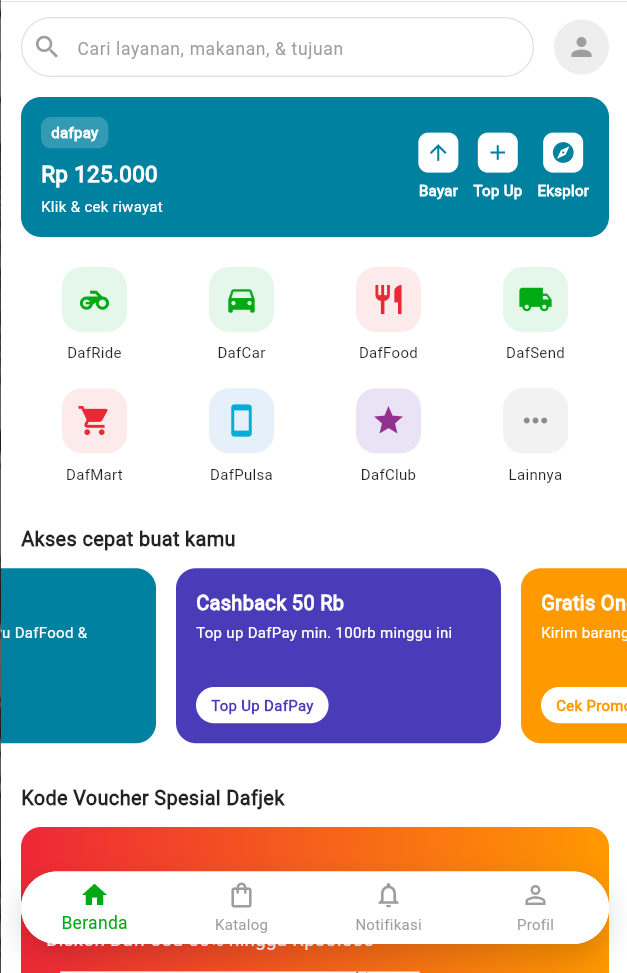
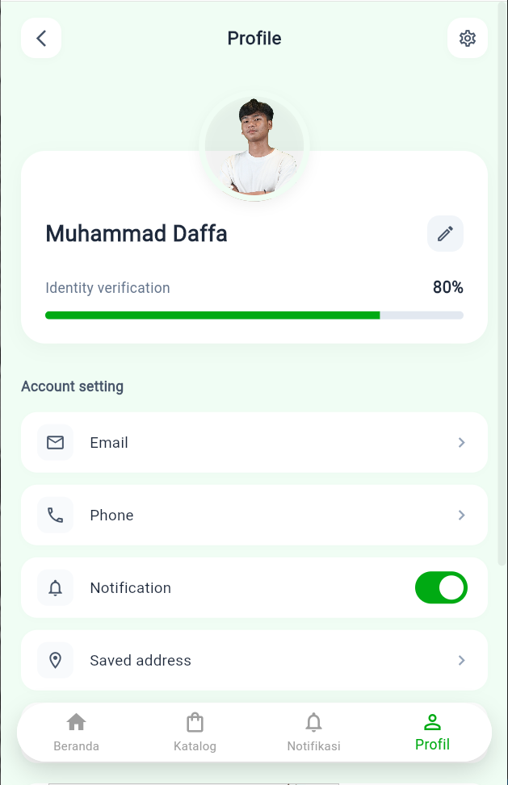

# UTS Pemrograman Mobile - Flutter

Aplikasi mobile sederhana menggunakan Flutter yang mencakup alur autentikasi, navigasi antar halaman, serta manajemen profil pengguna. Proyek ini dibuat untuk memenuhi Ujian Tengah Semester (UTS) mata kuliah Pemrograman Mobile.

## Struktur Folder
- `project_flutter/`: Source code aplikasi Flutter.
- `screenshots/`: Tangkapan layar (screenshot) dari aplikasi.

## Fitur Aplikasi
- **Login Page**: Autentikasi dengan validasi email dan password.

- **Home Page**: Menampilkan daftar item menggunakan ListView.

- **Profile Page**: Menampilkan dan mengedit profil pengguna (simulasi CRUD).

- **Routing**: Navigasi antar halaman menggunakan Navigator.

- **Katalog Produk**: Menampilkan daftar produk menggunakan GridView.

-**Detail Produk**: Menampilkan detail produk menggunakan ListView.

-**notifikasi**: Menampilkan notifikasi menggunakan Snackbar.

